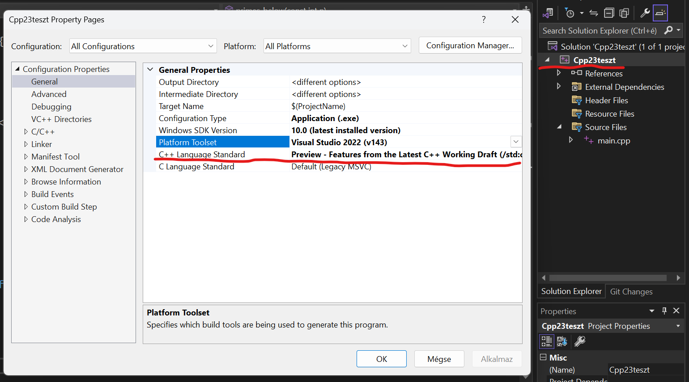

# Tartalom

- [BEVEZETÉS](#bevezetés)
- [KISEBB ÚJÍTÁSOK](#kisebb-újítások)
  - [auto kulcsszó (C++11)](#auto-kulcsszó)
  - [print és println (C++20)](#print-és-println)
- [OKOSPOINTEREK](#okospointerek)
  - [unique_ptr (C++11)](#unique_ptr)
  - [shared_ptr (C++11)](#shared_ptr)
- [LAMBDA FÜGGVÉNYEK](#lambda-függvények)
  - [Lambdák alapjai (C++11*)](#lambdák-alapjai)
  - [Lambdák és az STL tárolók (C++11*)](#lambdák-és-az-stl-tárolók)

\* - *A fő funkciók az adott szabvány részei, de egyes kisebb elemek csak újabb verziókban elérhetőek*  

# Bevezetés

Ez a kurzus arra a célra van szánva, hogy a C++ modern képességeit demonstrálhassuk, megtaníthassuk a résztvevőknek. A mostani programozás képzés nem tartalmazza a modern C++ (C++14, C++17, stb.) anyagait, melyek gyakran egyszerűbbé, hatékonyabbá, és jobbá tehetnék a munkánkat, és általunk gyártott programokat is.  
Ebben a kurzusban számos új, hasznos dolgot kívánok átadni, melyek tartalmaznak mindenféle nyelvi funkciót a C++23-ig bezárólag. A résztvevőknek ajánlott minimum az IPA tárgy teljesítése, de a MOO nagyon erősen ajánlott, habár objektum orientált programozás nem lesz a kurzusban.

**FONTOS:**  
Nem minden szabványos dolog van engedélyezve alapból az egyes fordítókban, pl.: Visual Studio alapból C++14-et használ. Ha ZH-n ennél újabbat próbálsz beadni, abból baj is lehet!  
Az új szabványokat a következő módon lehet beállítani fordítótól függően:

- gcc és clang: fordító utasításba be kell illeszteni azt, hogy `-std=SZABVANY`, mi esetünkben `-std=c++23`
- Visual Studio: Menjetek a projekt ($PROJEKTNEV \Rightarrow Properties$) beállításokba, és állítsátok a `C++ Language Standard` beállítást `Preview`-re

# Kisebb újítások

A modern C++-ban van pár kulcsszó, ami - habár nem jelent sokat magában - jóval egyszerűbbé teheti a munkánkat.

## auto kulcsszó

Ha egy változó típusa egyértelmű, mivel a létrehozásnál az egyenlőségjel jobb oldalán lévő típust meg tudjuk használni, akkor használható típusnév helyett az `auto` kulcsszó is, ilyenkor a fordító dönti el neked a típust.

Példakód:

~~~C++
// még függvénynél is működik, minden
// paraméterkombinációra új függvényt is alkothat
auto szoroz(auto egyik, auto masik) {
    return egyik * masik;
}

int main() {
    // fordító tudja, hogy double*
    auto ujadat = new double[5];

    // int, = -45
    auto eredmeny = szoroz(5, -9);

    // double, = -4.2
    auto eredmeny = szoroz(-2.1, 2);

    delete[] ujadat;
}
~~~

## print és println

Nem tetszik a `cout` és egy okosabb verziót akarsz a printf-ből? Erre van C++23 óta a `<print>` könyvtár, ami azt csinálja, amire gondoltok: bővített, optimalizált printf, aminél a formázás szimplább is:

~~~C++
#include <print>
#include <vector>

using namespace std; // különben std::println

int main() {
    println("Uj sor van utana, nem kell \\n");

    auto adat = 7;

    // behelyettesítés
    print("A szam: {}\n", adat);

    println("Sorrendet is lehet adni id-vel: {0} {2} {2} {1}", 0, 1, 2, 3);

    auto ertek = sqrt(2);
    // 2 tizedes (megj.: f, nem lf kell)
    println("Tiezedesertekkel: {:.2f}", ertek);

    // Kiirt ertek hosszanak megadasa
    println("Ez 5 karakter: {:5}", adat);
    println("Ez is: {:5.3}", ertek);

    // Még STL tárolókat is ki tud írni (amire se cout, se printf nem képes)
    vector<int> adatok = {1, 2, 4, 8};
    println("Adatok: {}", adatok);
}
~~~

## optional

Írtál már olyan függvényt, ami nem biztos, hogy sikeresen fut le? Ilyenkor általában két, szuboptimális megoldást szoktak alkalmazni: vagy egy lehetetlen értéket (pl.: -1 vagy `nullptr`) adnak vissza, és *remélik*, hogy a függvény hívója lekezeli az esetleges hibát, vagy a `throw` kulcsszóval egy hibát dobnak, és feltételezik, hogy a hívás egy `try` blokkban van, ahol erre a specifikus errorra is van írva `catch`. Egyiknél sem mindig egyértelmű, hogy kaphat-e futási errort a felhasználó a függvényre nézve, és lehet, hogy nem kezelik. Kilépni a programból minden error esetén sem jó megoldás, mert nem minden hiba olyan kritikus, hogy le kell állítani az egészet. Ezért implementálták az `optional<T>` osztályt.  
Az `optional<T>` egyszerű logikával működik: egy függvény, ami ezt ad vissza vagy egy `T` típusú értéket kap, vagy egy üres hibaértéket. Ahhoz, hogy a programozó akármit is kapjon vissza, mindkét esetet kezelni kell, de ez nagyon egyszerű tud lenni: vagy if-ben nézi, hogy jó-e, vagy ha hiba esetén egy másik értéket használna, csak hívja a `.value_or()` függvényt.

~~~C++
#include <optional>
#include <print>

std::optional<int> fibonacci(int val) {
    // ha val < 0, akkor nincs érték, tehát üres {} értéket ad vissza
    if (val < 0) {
        return {};
    }

    // sikernél sima return elég
    if (val < 2) {
        return val;
    }

    // ha garantált, hogy van érték, akkor .value() visszaadja
    return fibonacci(val - 1).value() + fibonacci(val - 2).value();
}

int main() {
    const int ertek = 5;

    // nem kritikus kód, ha az érték hibás, akkor használjunk egyet helyette
    // ilyenkor azonnal lehet int-be tárolni
    const int eredmeny = fibonacci(ertek).value_or(1);

    std::println("Eredmeny: {}", eredmeny);

    // hibás érték keresése kritikus kódrészletben
    const auto kritkus = fibonacci(-7);

    if (!kritkus) {
        std::println("KRITIKUS ERROR! Rossz ertek volt a fib fuggvenynek adva!");
        exit(-1);
    }

    std::println("Minden jol lefutott, a fontos eredmeny: {}", kritkus.value());
}
~~~

# Okospointerek

Veszítettél már pontot prog ZH-n, mert elfelejtetted a `free` vagy `delete` hívását? Esetleg kicímeztél, mert balesetből kétszer hívtad? A C++11-től kezdve van erre megoldás: az okospointer!  
Az okospointer egy olyan, `<memory>` könyvtárba épített osztály, ami magától tudja eldönteni, hogy mikor szabadítja fel a benne tárolt memóriát. Mivel template osztály, akármilyen típusra alkalmazható, és használatban nem vehető észre az, hogy nem sima pointer (minimális szintaktikai eltéréseken kívül).

## unique_ptr

A `std::unique_ptr` a legegyszerűbb ezek közül: Gyakorlatban csak egy osztály 1 pointerrel, ami a destruktorban felszabadítja magát. Azt garantálja, hogy biztos egyszer, és csak egyszer szabadítja fel a benne tárolt pointert, de nem lehet ezt a pointert átadni más okospointernek, ezért egyedi.

~~~C++
#include <memory>

int main() {
    // paraméter nélkül automatikusan hívja
    // az üres konstruktort
    std::unique_ptr<int> adat;

    *adat = 5;

    // nincs delete, felszabadul magától

    // TÖMBÖK

    std::unique_ptr<double[]> adatok(new double[10]);

    // jobb megoldás
    auto adatok = std::make_unique<double[]>(10);

    adatok[5] = 7;

    // új pointerre cserélés
    // = operátor NINCS, errort ad
    // a pointerből csak 1 példány lehet
    adatok.reset(new double[20]);
}
~~~

## shared_ptr

Ha az okospointerből több példányunk van, és nem egyértelmű, hogy melyik szabadítja fel, akkor a `shared_ptr` a legjobb megoldás. Ellentétben a `unique_ptr`-rel ez nem csak a pointert tárolja, hanem azt is, hogy hány különböző helyen van tárolva, ami nőhet új példány létrehozásánál, vagy csökkenhet törlésnél is. Ha az utolsó törlődik, a memória felszabadul. Ez főleg többszálas programokra jó.

~~~C++
#include <memory>
#include <string>
#include <print>

void feldolgoz(std::shared_ptr<std::string> adat) {
    std::println("{}", *adat);
}

void bovit(std::shared_ptr<std::string> adat, const std::string& mivel) {
    *adat += mivel;
}

int main() {
    auto str = std::make_shared<std::string>("Lol");

    // Ide-oda dobáljuk str-t, nem egyértelmű (a programnak)
    // hogy hol szabadul fel
    feldolgoz(str);
    
    for (auto i = 0; i < 10; i++) {
        // ugyanaz a memóriaterület, de nem kell aggódni
        // rosszul időzített delete miatt
        auto most = str;
        bovit(most, "HI");
    }

    feldolgoz(str);

    // Itt szabadul csak fel
    // Konzol:
    /*
    Lol
    LolHIHIHIHIHIHIHIHIHIHI
    */
}
~~~

# Lambda függvények

## Lambdák alapjai

Volt már olyan, hogy egy függvényt csak egy másik függvényen belül akartál használni? Akár egy algoritmus alapján törölöni, szortísozni, módosítani adatsort? Erre vannak az ú.n. lambda függvények, melyekkel függvényeket akárhol hozhatunk létre, és akárhogy fel tudjuk használni, pl.: paraméterként.  
Maguk a lambdák a következő szintaxissal rendelkeznek:

~~~C++
#include <print>

auto lambda = [/* megfogott valtozok*/] (/*parameterek*/) {
  // kód, ha van return, olyan típusú, különben void 
};

int main() {
    // Példa: prím-e az érték?
    auto is_prime = [] (const int x) {
        const auto limit = x / 2 + 1;

        if (x == 2) return true;
        if (x < 2 || x % 2 == 0) return false;

        for (auto i = 3; i < limit; i += 2)
            if (x % i == 0) return false;
        
        return true;
    };

    std::println("{}", is_prime(5)); // true
    std::println("{}", is_prime(6)); // false
}
~~~

A szögletes zárójeleknek egy speciális szerepe van, ezzel lokális változókat lehet a függvénynek átadni vagy értékként, vagy referenciaként. De C++20 óta lehet benne olyan változókat is létrehozni, melyek hívások között megmaradnak (mint a statikus változók). Ezeket a változókat lehet módosítani, ha a kapcsos zárójel elé helyezzük a `mutable` kulcsszót.

~~~C++
#include <print>

int main() {
    int hivasok = 0;

    // hivas_szam: belső változó, 0-tól indul
    // &hivasok: hivasok változó referenciaként használható lambdában, ezért módosítható is
    auto hanyszor_hivtak = [hivas_szam = 0, &hivasok] () mutable {
        hivas_szam++; // módosítható, mert mutable
        hivasok = hivas_szam;
        std::println("{}. hivas", hivas_szam);
    };

    for (auto i = 0; i < 10; i++) {
        hanyszor_hivtak();
    }

    std::println("Összesen {} hivas", hivasok);
}
~~~

## Lambdák és az STL tárolók

A lambdáknak az egyik legnagyobb előnye, hogy STL tárolókon (pl.: `array`, `vector`, `list`) lehet őket felhasználni bizonyos algoritmusokban az `<algorithm>` könyvtár felhasználásával. A lambdákat ilyenkor nem kell változóban tárolni, azonnal lehet használni paraméterként.  
[Ezekből elképesztően sok van](https://en.cppreference.com/w/cpp/header/algorithm), de itt egy példa pár hasznosabbról:

~~~C++
#include <print>
#include <vector>
#include <array>
#include <algorithm>

int main() {
    std::vector<double> adatok = {-2.0, 7.9, 2.5, -8.9, 100.9};

    // std::for_each: lambdát futtat a tároló minden elemén
    std::for_each(adatok.begin(), adatok.end(), [index = 0](const auto ertek) mutable {
        std::println("{}. ertek: {}", index, ertek);
        index++;
    });

    // std::find_if: megkeresi az első elemet, amire igaz a lambda
    auto nagyobb_mint_5 = std::find_if(adatok.begin(), adatok.end(),  {
        return ertek > 5;
    });

    std::println("Elso jo elem: {}", *nagyobb_mint_5);

    // std::sort: megadott feltétel alapján szortíroz
    // lambda paraméterek: két elem, visszaadja, hogy fel kell-e őket cserélni
    // példa: négyzetes nagyság alapján szűrés
    std::sort(adatok.begin(), adatok.end(),  {
        return a * a > b * b;
    });

    std::for_each(adatok.begin(), adatok.end(),  {
        std::print("{} ", ertek);
    });
    std::println("");

    // std::any_of: igaz-e a feltétel legalább 1 elemre
    // param: elem, visszaadja, hogy megfelel-e
    auto megfelel = std::any_of(adatok.begin(), adatok.end(),  {
        return ertek > 10;
    });
    if (megfelel)
        std::println("Megfelel");
    else
        std::println("Nem felel meg");
    
    // std::transform: Tároló elemeit módosítja lambda szerint
    // ha a harmadik elem maga a tároló, helyben módosítja, ha nem
    // máshol is lehet tárolni az eredményt
    std::vector<int> ertekek = {1, -2, 3};
    std::println("Ertekek eredetileg: {}", ertekek);

    std::transform(ertekek.begin(), ertekek.end(), ertekek.begin(),  {
        return val * val;
    });

    std::println("Ertekek transform utan: {}", ertekek);

    // más fajta tárolóba is lehet rakni az elemet
    std::array<int, 20> eredmeny = {};

    std::transform(ertekek.begin(), ertekek.end(), eredmeny.begin(),  {
        return val * 4;
    });

    std::println("STL tömbben: {}", eredmeny);
}
~~~
