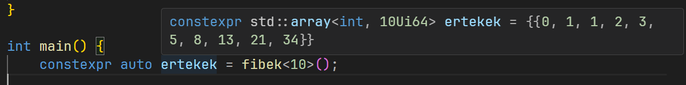

# Tartalom

- [BEVEZETÉS](#bevezetés)
- [SABLONOK A C++-BAN](#sablonok-a-c-ban)
  - [SABLONOK ALAPJAI (C++98)](#sablonok-alapjai)
  - [SABLONOK SZABÁLYOZÁSA (C++20)](#sablonok-szabályozása)
- [ALGEBRAI TÍPUSOK](#algebrai-típusok)
  - [PAIR ÉS TUPLE (C++11*)](#pair-és-tuple)
  - [VARIANT (C++17)](#variant)
- [FORDÍTÁSI IDEJŰ PROGRAMOZÁS A CONSTEXPR KULCSSZÓVAL (C++14, C++17, C++20)](#fordítási-idejű-programozás-constexpr-el)
  - [CONSTEXPR ALAPOK (C++14)](#constexpr-alapok)
  - [LAMBDÁK ÉS CONSTEXPR (C++17)](#lambdák-stl-és-constexpr)
  - [CONSTEXPR FELTÉTELEK (C++17)](#constexpr-feltételek)

# Bevezetés

A kurzus 2. alkalmának kereteiben a C++ fordítóját fogjuk kihasználni, aminek hála a munka jelentős részét a fordító automatikusan csinálja helyettünk, legyen az kódgenerálás, függvények futtatása fordításkor, vagy sablon alapján típus/függvénygenerálás.

# Sablonok a C++-ban

## Sablonok alapjai

A sablonok a C++ egyik legrégebbi, de legerősebb újítása: egyszer megírt osztályt fordításkor ismert paraméterek alapján lehet különböző formákba építeni. Erre egy példa, amit múltkor használtunk már, a `std::vector<T>`. A `<T>` egy sablon, ami szerint fordításkor adhatunk neki egy $T$ típust, amit behelyettesít, és ha nem okoz ez semmilyen errort, akkor ezt akárhány különböző típussal meg lehet ismételni úgy, hogy a `vector` osztályt csak egyszer írták le a készítők.

Sablont osztályból a `template` kulcsszóval lehet csinálni, ahol relációs jelek között a fordítási paramétereket lehet definiálni:

~~~C++
#include <print>

// typename vagy class: típus, amit be lehet helyettesíteni
template <typename T>
struct vektor {
    // T-t fordításkor behelyettesíti egy adott típusra
    T x, y;

    vektor(T x, T y) : x(x), y(y) {}

    T hossz() {
        return T(sqrt(x * x + y * y));
    }
};

int main() {
    // T helyére akármit be lehet helyettesíteni
    vektor<int> egyik(1, 2);
    vektor<double> masik(-9.8, 3.14159);

    std::print("Egyik hossza: {}\nMasik hossza: {}", egyik.hossz(), masik.hossz());
}
~~~

Ezt az eszközt gyakran típusok behelyettesítésére használják, de akár sima értékeket (pl.: `int`, `double`) is lehet felhasználni. Ennek egy nagy haszna az, hogy fordításkor ismert mérettel lehet statikus tömböket használni az osztályban, nem kell pointerezni.

~~~C++
#include <print>
#include <string>

template <typename T, size_t Meret>
class tomb {
private:
    // Mivel Meretet ismerjük fordításkor, ezért
    // lehet statikus tömböt csinálni vele
    T data[Meret];

public:
    // nem kell Meretet tárolni, elég egy függvényt
    // írni, ami visszaadja az értékét
    inline const size_t meret() const { return Meret; }

    // Referenciát ad vissza, hogy a tömbérték módosítható legyen
    inline T& operator {
        return data[index];
    }

    void print() const {
        std::print("[");
        for (size_t i = 0; i < Meret - 1; i++) {
            std::print("{}, ", data[i]);
        }
        if (Meret != 0) {
            std::print("{}", data[Meret - 1]);
        }
        std::print("]");
    }
};

int main() {
    tomb<double, 3> egyik;
    egyik[0] = 1.2;
    egyik[1] = 6.9;
    egyik[2] = -0.24;

    egyik.print();
    std::println("\nA tomb {} byte, ami {} elem * {} byte per elem", sizeof(egyik), 3, sizeof(double));

    tomb<std::string, 2> masik;

    masik[0] = "Ezt is lehet";
    masik[1] = "Akarmilyen tipus hasznalhato";

    masik.print();
}
~~~

Függvényekből is lehet sablont csinálni, ugyanazzal a szintaxissal. Az újabb szabványok egyik előnye, hogy gyakran a paraméterekből a sablonparamétereket is kitalálja.  
Az előző példát ezek alapján lehet bővíteni:

~~~C++
#include <print>
#include <string>

template <typename T, size_t Meret>
class tomb {
private:
    // Mivel Meretet ismerjük fordításkor, ezért
    // lehet statikus tömböt csinálni vele
    T data[Meret];

public:
    // nem kell Meretet tárolni, elég egy függvényt
    // írni, ami visszaadja az értékét
    inline const size_t meret() const { return Meret; }

    inline T& operator {
        return data[index];
    }

    inline const T& operator const {
        return data[index];
    }

    void print() const {
        std::print("[");
        for (size_t i = 0; i < Meret - 1; i++) {
            std::print("{}, ", data[i]);
        }
        if (Meret != 0) {
            std::print("{}", data[Meret - 1]);
        }
        std::print("]");
    }
};

template <typename T, size_t Meret>
T szumma(const tomb<T, Meret>& adatok) {
    T sum{};

    for (size_t i = 0; i < Meret; i++) {
        sum += adatok[i];
    }

    return sum;
}

int main() {
    tomb<double, 3> egyik;
    egyik[0] = 1.2;
    egyik[1] = 6.9;
    egyik[2] = -0.24;

    egyik.print();
    std::println("\nA tomb {} byte, ami {} elem * {} byte per elem", sizeof(egyik), 3, sizeof(double));

    // nem kötelező <double, 3> kiírása, paraméterből ki tudja találni a fordító
    std::println("Szumma: {}", szumma(egyik));

    tomb<std::string, 2> masik;

    masik[0] = "Ezt is lehet";
    masik[1] = "Akarmilyen tipus hasznalhato";

    masik.print();
    std::println("\n{}", szumma<std::string>(masik));
}
~~~

## Sablonok szabályozása

Az előző példák bemutatták a sablonok előnyeit, viszont van egy hátrány: ha a behelyettesített típus errorhoz vezet, gyakran oldal méretű errorokat ad, amiket lehetetlen debuggolni.

Például, ha az előző fejezet `vektor` példaosztályába stringet helyettesítünk be, a következő errort kapjuk:

Ez csak azt mondja, hogy a `vektor<std::string>::hossz()` függvényt nem tudta lefordítani, nem pedig azt, hogy $T$-nek számértéknek kellene lennie. Ebben az esetben még valamennyire érthető, de nagyobb osztályok és többréteges behelyettesítéseknél már nem.  

Azért, hogy meg lehessenek szabva szabályok a behelyettesítéseknek, több szabvályban különböző új dolgokat adtak a nyelvhez, hogy - amennyiben valami ezeket a szabályokat megszegi - érthető errorokat kapjon a fejlesztő. Ezek közül a `requires` kulcsszóról, és a `<type_traits>` könyvtárról lesz szó.  

A `requires` kulcsszó alapján egyes osztályoknak, függvényeknek vagy tagfüggvényeknek egy ifhez hasonló módon lehet megadni, hogy a paraméterek alapján szabad-e lefordítani.  

A `<type_traits>` könyvtár engedélyezi, hogy osztályok tulajdonságait igen/nem értékké alakítsa a fordító.

Például, egy vektornál azt akarjuk, hogy az adatok, amiket tárol, számok legyenek. Tehát ha azt mondjuk, hogy $T$ vagy egész (`is_integral_v`) vagy lebegőpontos (`is_floating_point_v`) típus:

~~~C++
template <typename T>
requires (std::is_floating_point_v<T> || std::is_integral_v<T>)
class vektor2 {
    // ...
};
~~~

Ha ebbe az osztályba stringet helyettesítünk be, akkor egy egyszerűbb errort kapunk, hogy a vektor korlátainak nem felel meg a `T = std::string` behelyettesítés:

Amennyiben ilyen feltételeket többször használunk, vagy az errort olvashatóbb formába akarjuk alakítani, akkor tudunk egy `concept`-et írni. Ezek a kifejezések nem csak a `type_traits` tulajdonságait tudják felhasználni, hanem ha adsz nekik egy példakódot, akkor az alapján, hogy egy adott típust behelyettesítve ad-e errort a mintakód, tudja eldönteni, hogy megfelelnek-e a template paraméterek.  
Például, ha egy számot akarunk kifejezésben leírni, a következő módokon is csinálhatjuk:

~~~C++
template <typename T>
concept number = requires (T egyikSzam, T masikSzam) {
    double(egyikSzam); // double-re alakithatonak kell lennie
    // Alap matematikai műveleteknek meg kell felelnie
    // ha ezek egyike nem fordul le, akkor T nem felel meg a szám koncepciónak
    egyikSzam + masikSzam;
    egyikSzam - masikSzam;
    egyikSzam * masikSzam;
    egyikSzam / masikSzam;
    egyikSzam == masikSzam;
    egyikSzam > masikSzam;
    egyikSzam >= masikSzam;
    egyikSzam < masikSzam;
    egyikSzam <= masikSzam;
};

template <number T>
struct vektor {
    // ...
};
~~~

Ha most próbálunk egy hibás típust (ezesetben stringet) behelyettesíteni, akkor a fordító jelzi nekünk, hogy a `std::string` nem felel meg a `number` kifejezésnek:

A `concept` kifejezéseknek egyik előnye, hogy függvényekben elég `auto` kulcssó elé elhelyezni, és `requires` rész nélkül is garantálja a fordító, hogy minden korrekt:

~~~C++
auto abszolut(number auto szam) {
    if (szam < 0) {
        return 0 - szam;
    } else {
        return szam;
    }
}

int main() {
    std::print("{} {}", abszolut(-1.0), abszolut(2));
}
~~~

# Algebrai típusok

## Pair és tuple

Ha írtál már függvényt, ami több, mint 1 értéket adott vissza, akkor esély szerint olyan megoldásokat kellett alkalmazni, mint például egyik referencia paraméter módosítása. Emiatt gyakran nem egyértelmű, hogy mit csinál a program, nehezebben olvasható, és a referencia miatt már máshol kellett változót csinálni a függvényhívás miatt.  
A `std::pair<T1, T2>` és `std::tuple<T...>` engedélyezi, hogy 2 (pair esetében) vagy több (tuple esetében) értéket adjatok vissza, amik nagyjából akármilyen típusuak lehetnek.

~~~C++
#include <tuple>
#include <print>
#include <vector>

std::pair<double, double> minmax(const std::vector<double> tomb) {
    if (tomb.empty()) { return { -NAN, -NAN }; }

    double min = tomb[0], max = tomb[0];

    for (size_t i = 1; i < tomb.size(); i++) {
        if (tomb[i] > max) { max = tomb[i]; }
        if (tomb[i] < min) { min = tomb[i]; }
    }

    // kapcsos zárójelben, vagy a std::make_pair függvénnyel lehet létrehozni pair-t
    return {min, max};
}

int main() {
    std::vector adatok = { 1.0, -9.8, 42.0, -721.10, 6.9, 98128.98 };
    
    double minAdat, maxAdat;

    // Egyik módja a megoldás megszerzésének:
    auto eredmeny = minmax(adatok);
    minAdat = eredmeny.first;
    maxAdat = eredmeny.second;

    // Másik:
    std::tie(minAdat, maxAdat) = minmax(adatok);

    std::println("{} minimuma {}, maximuma {}", adatok, minAdat, maxAdat);
}
~~~

C++17-től azonnal lehet frissen létrehozott változókba is értéket rakni tuple-ből:

~~~C++
// ...

int main() {
    std::vector adatok = { 1.0, -9.8, 42.0, -721.10, 6.9, 98128.98 };
    
    auto [minAdat, maxAdat] = minmax(adatok);

    std::println("{} minimuma {}, maximuma {}", adatok, minAdat, maxAdat);
}
~~~

A `tuple` is hasonló, csak ott ha az elemekhez hozzá akarunk férni, akkor a `std::get<V>` függvényt kell alkalmazni:

~~~C++
#include <tuple>
#include <vector>
#include <print>
#include <cmath>
#include <type_traits>
#include <concepts>

template <typename T>
concept number = requires (T egyikSzam, T masikSzam) {
    double(egyikSzam); // double-re alakithatonak kell lennie
    // Alap matematikai műveleteknek meg kell felelnie
    // ha ezek egyike nem fordul le, akkor T nem felel meg a szám koncepciónak
    egyikSzam + masikSzam;
    egyikSzam - masikSzam;
    egyikSzam * masikSzam;
    egyikSzam / masikSzam;
    egyikSzam == masikSzam;
    egyikSzam > masikSzam;
    egyikSzam >= masikSzam;
    egyikSzam < masikSzam;
    egyikSzam <= masikSzam;
};

template <number T>
std::tuple<double, T, T> statisztika(const std::vector<T>& adatok) {
    if (adatok.empty()) { return {0, NAN, NAN}; }

    double szumma = adatok[0];
    T min = adatok[0], max = adatok[0];

    for (const auto& i : adatok) {
        szumma += double(i);
        if (min > i) { min = i; }
        if (max < i) { max = i; }
    }

    return {szumma / adatok.size(), min, max};
}

int main() {
    const std::vector halmaz = {1.0, -9.81, 42.0, -9768.987};

    auto stats = statisztika(halmaz);

    std::println("Halmaz atlaga: {}\nMinimuma: {}\nMaximuma: {}", std::get<0>(stats), std::get<1>(stats), std::get<2>(stats));
}
~~~

## Variant

Amennyiben esettől függően változhat, hogy milyen típusokat ad vissza egy függvény, vagy egy osztálynak esettől függően változó típusú értékei lehetnek, `std::variant<T...>` típusú értéket hasznos alkalmazni. Amennyiben az egyik opció az, hogy nincs érték tárolva (hasonlóan az `optional<T>`-hez), az egyik lehetőségnek `std::monostate`-et írhatunk:

~~~C++
#include <variant>
#include <print>
#include <cmath>

std::variant<std::monostate, double, std::pair<double, double>> masodfoku(double a, double b, double c) {
    const double D = b * b - 4 * a * c;
    const double epsilon = 1e-6;

    // nincs valós megoldás
    if (D < -epsilon) {
        return std::monostate();
    }

    // egy valós megoldás van
    if (abs(D) < epsilon) {
        return -b / (2.0 * a);
    }

    // két valós megoldás
    const double gyokD = sqrt(D);
    
    return std::make_pair(
        (-b + gyokD) / (2.0 * a),
        (-b - gyokD) / (2.0 * a)
    );
}

int main() {
    // próbáljuk megoldani az x^2 - x - 1 = 0 egyenletet!
    const auto eredmeny = masodfoku(1, -1, -1);
    
    if (std::holds_alternative<std::monostate>(eredmeny)) {
        std::println("Nincs megoldasa az egyenletnek!");
    } else if (std::holds_alternative<double>(eredmeny)) {
        std::println("Egy megoldas van, ami {}", std::get<double>(eredmeny));
    } else {
        std::println("Ket megoldas van: {}", std::get<std::pair<double, double>>(eredmeny));
    }
}
~~~

Ennél jobb megoldás is van a `std::visit` függvénnyel, de először meg kell ismernünk pár más fogalmat is.

# Fordítási idejű programozás constexpr-el

A C++ egyik legjelentősebb újítása a `constexpr`: fordítás alatt lehet kódot futtatni. Habár más nyelvekben is lehet például fordításkor képletet kiszámolni, itt ez annál jóval többre képes: egész algoritmusokat, függvényeket, osztályokat lehet fordításkor kiértékelni. [Például betűtípusok legenerálása fordításkor](https://youtu.be/MdrfPSUtMVM?si=JKZoAvHud5LxsaJj).

## constexpr alapok

Minden kifejezés, ami a `constexpr` (constant expression, konstans kifejezés) kulcsszóval van jelölve, két dolgot feltételez:

- A kifejezés minden eleme ismert, vagy meghatározható fordításkor
- A kiértékelt kifejezés lehet konstans

Ha ezek teljesülnek, akkor a kulcsszó alkalmazásával egy változó, függvény, tagfüggvény, sablon, vagy akár lambda is fordításkor kiértékelhető.

A legegyszerűbb példa két `constexpr` változó összeadása:

Az alsó ablakban látható, hogy a két érték össze lett adva, impliciten átalakítva intre (mert az kell `main`-nek), és visszaadva a fő függvényben. [Ilyen tesztekhez ajánlom a GodBolt fordító tesztelő eszközt, online lehet tesztelni ott különböző fordítók viselkedését majdnem minden programnyelvben](https://godbolt.org/).

Ezt függvényekre is lehet bővíteni, és az újabb verziókban a standard könyvtár jelentős része már `constexpr` kompatibilis:

~~~C++
#include <cmath>

constexpr bool is_prime(int n) {
    // <cmath> jelentős része constexpr új szabványokban
    const int limit = sqrt(n) + 1;

    if (n == 2) { return true; }
    if (n == 1 || n % 2 == 0) { return false; }

    for (int i = 3; i < limit; i++) {
        if (n % i == 0) { return false; }
    }

    return true;
}

int main() {
    return is_prime(5);
}
~~~

Ha ellenőrizzük az assembly kódját, látható, hogy ezt is sikerült kiszámolnia, és 2 utasításra redukálnia a fordítónak

~~~nasm
main:
        mov     eax, 1
        ret
~~~

Azt fontos megjegyezni, hogy egy `constexpr` függvény felhasználható futáskor is, mint egy sima függvény, ezért függvények esetében a kulcsszó használata szinte mindig ajánlott, mert nincs mit veszteni vele.

Egy dolog, amire felhasználható a `constexpr` kettős természete (futáskor és fordításkor is létezik), amit a C-ben nem lehetett megtenni, stringek `switch`-ben kezelése. Ehhez egy úgy nevezett "*hash*" függvényt kell írni, aminek csak az a lényege, hogy a változó hosszal rendelkerű szöveget egy számmá redukáljuk, ami minden különböző bemenetre más eredményt ad. Ezt általában ide-oda dobált bitmágiával oldják meg az emberek (tényleg elég random bitműveleteket alkalmazni az esetek többségében, nem kell bitvarázslónak lenni):

~~~C++
#include <string>
#include <iostream> // cin-hez kell
#include <print>

using namespace std;

constexpr size_t hash_str(string str) {
    const size_t hossz = str.length();

    size_t hash = 0;

    for (size_t i = 0; i < hossz; i++) {
        // Random bitműveletek
        // csak dobálj ide párat, előbb-utóbb csak működni fog
        hash += size_t(str[i]) << (size_t(str[i]) % 32);
    }

    return hash;
}

int main() {
    print("Szereted a tejet? ");

    string res;
    getline(cin, res);

    switch (hash_str(res)) {
    case hash_str("igen"):
        print("Es a kakaot is? ");
        getline(cin, res);
        if (res == "azt is") {
            println("Nagyon jo");
        }
        break;
    case hash_str("laktozerzekeny vagyok"):
        println("Megis mi a baj veled?");
        break;
    case hash_str("nem"):
        println("Szomoruva tettel :(");
        break;
    default:
        println("wut");
        break;
    }
}
~~~

## lambdák, STL és constexpr

C++17 óta lambdák is lehetnek konstans kifejezések:

~~~C++
#include <array>
#include <cstdint>
#include <cmath>
#include <print>

// number koncepció előző pontból, fordításkor fut, lehet
// constexpr algoritmusban felhasználni
template <typename T>
concept number = requires (T egyikSzam, T masikSzam) {
    double(egyikSzam);
    egyikSzam + masikSzam;
    egyikSzam - masikSzam;
    egyikSzam * masikSzam;
    egyikSzam / masikSzam;
    egyikSzam == masikSzam;
    egyikSzam > masikSzam;
    egyikSzam >= masikSzam;
    egyikSzam < masikSzam;
    egyikSzam <= masikSzam;
};

constexpr auto tomb_szumma =  {
    double szumma = 0;

    for (const auto& i : tomb) {
        szumma += i;
    }

    return szumma;
};

int main() {
    std::array egyik = { 1, -9, 876, -256, 69 };
    std::array masik = { -9.8, 7.8, 1.9872 };

    return std::max(tomb_szumma(egyik), tomb_szumma(masik));
}

/*asm:
main:
    mov eax, 681
    ret
*/
~~~

Ezzel együtt a C++17 egy másik újítása az, hogy **sok STL tároló is lehet `constexpr`, de egy fontos korlátozással: dinamikusan foglalt memóriát statikussá kell alakítani, ha futáskor akarjuk felhasználni.** Mit jelent ez? Lehet `constexpr std::vector`-unk (ami egy dinamikus tömb), de ha futáskor is fel akarjuk használni, `std::array`-t (statikus tömböt) kell belőle csinálni.

~~~C++
#include <array>
#include <vector>
#include <print>

// auto, mert függvényhívás elején a méret nem ismert
template <size_t hany>
constexpr auto fibek() {
    std::vector<int> fibs = {0, 1};

    for (int i = 2; i < hany; i++) {
        fibs.push_back(fibs[i - 1] + fibs[i - 2]);
    }

    // Át kell másolni az adatokat egy arraybe, mert constexpr vector
    // futáskor nem használható
    std::array<int, hany> ret;
    std::copy(fibs.begin(), fibs.begin() + hany, ret.begin());

    return ret;
}

int main() {
    // [0, 1, 1, 2, 3, 5, 13, 21, 34]
    constexpr auto ertekek = fibek<10>();
    std::println("{}", ertekek);
}
~~~

Esetfüggően a kódszerkesztőben a végeredményt még a kód futtatása előtt is lehet látni:

Amennyiben egy constexpr függvénnyel, vagy lambdával meg tudjuk használni az elemszámot, az is alkalmazható, mint a visszaadott tömb mérete:

~~~C++
#include <array>
#include <vector>
#include <print>

using namespace std;

template <size_t n>
constexpr auto harom_n_plusz_egy() {
    // azonnal felhasznált constexpr lambda, hogy az érték garantáltan
    // constexpr legyen (plusz így lehet konstans is)
    constexpr int iteracioszam =  {
        int val = n, iters = 1;

        while (val > 1) {
            if (val % 2 == 1) {
                val = val * 3 + 1;
            } else {
                val /= 2;
            }
            iters++;
        }

        return iters;
    }(n);

    vector<int> vals = { n };

    int val = n;

    while (val > 1) {
        if (val % 2 == 1) {
            val = val * 3 + 1;
        } else {
            val /= 2;
        }

        vals.push_back(val);
    }

    array<int, iteracioszam> ret;
    copy(vals.begin(), vals.end(), ret.begin());

    return ret;
}

int main() {
    constexpr int hany = 351;
    constexpr auto eredmeny = harom_n_plusz_egy<hany>();

    for (int i : eredmeny) {
        println("{}", i);
    }
}
~~~

## constexpr feltételek

A `constexpr` felhasználható abban a kapacitásban is, hogy a kód egyes részeit ki/be kapcsoljuk. Ehhez felhasználható az `if constexpr` feltétel. Ezen kívül a `static_assert` kulcszóval ellenőrizni lehet egy feltételt, és - amennyiben a feltétel hamis - a fordítás leáll.

~~~C++
#include <print>
#include <vector>

template <int val>
constexpr int fib() {
    static_assert(val >= 0, "Negativ Fibonacci szamot nem lehet meghatarozni!");

    std::vector<int> vals = { 0, 1 };

    for (int i = 2; i <= val; i++) {
        vals.push_back(vals[i - 1] + vals[i - 2]);
    }

    return vals.back();
}

int main() {
    constexpr int val = 5;

    std::println("{}", fib<5>());

    //std::println("{}", fib<-3>()); // Error: static_assert failed: 'Negativ Fibonacci szamot nem lehet meghatarozni!'
}
~~~

`if constexpr` kombinálható a `std::visit` függvénnyel, és így optimálisan lehet kezelni egy `std::variant<T...>` típusait:

~~~C++
#include <variant>
#include <print>
#include <type_traits>

int main() {
    std::variant<double, int, char> ertek = 'a';

    // auto mindenre hívódik
    std::visit( {
        std::println("{}", val);
        }, ertek);

    // típus eldöntése constexpr iffel
    std::visit( {
        // val típusának megszerzése
        using T = decltype(val);

        if constexpr (std::is_same_v<T, double>) {
            std::println("Double {}", val);
        } else if constexpr (std::is_same_v<T, int>) {
            std::println("Int {}", val);
        } else if constexpr (std::is_same_v<T, char>) {
            std::println("Char {}", val);
        }
    }, ertek);
}
~~~
